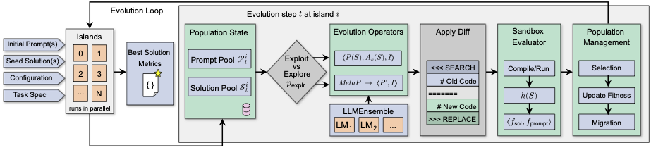

# CodeEvolve

[](LICENSE)
[](https://arxiv.org/abs/2510.14150)



**An open-source framework that combines large language models with evolutionary algorithms to discover and optimize high-performing code solutions.**

CodeEvolve democratizes algorithmic discovery by making LLM-driven evolutionary search transparent, reproducible, and accessible. Whether you're tackling combinatorial optimization, discovering novel algorithms, or optimizing computational kernels, CodeEvolve provides a modular foundation for automated code synthesis guided by quantifiable metrics.

## Why CodeEvolve?

**State-of-the-art performance with transparency.** CodeEvolve matches or exceeds the performance of closed-source systems like Google DeepMind's AlphaEvolve on established algorithm-discovery benchmarks, while remaining fully open and reproducible.

**Cost-effective solutions.** Open-weight models like Qwen often match or outperform expensive closed-source LLMs at a fraction of the compute cost, making cutting-edge algorithmic discovery accessible to researchers and practitioners with limited budgets.

**Designed for real problems.** CodeEvolve addresses meta-optimization tasks where you need to discover programs that solve complex optimization problems.

## Key Features

### Islands-based Genetic Algorithm
Multiple populations evolve independently and periodically exchange top performers, maintaining diversity while propagating successful solutions across the search space. This parallel architecture enables efficient exploration and scales naturally to concurrent evaluation.

### Modular Operators

**Inspiration-based Crossover:** Contextual recombination that combines successful solution patterns while preserving semantic coherence.

**Meta-prompting Exploration:** Evolves the prompts themselves, enabling the LLM to reflect on and rewrite its own instructions for more diverse search trajectories.

**Depth-based Exploitation:** Targeted refinement mechanism that makes precise edits to promising solutions, balancing global search with local optimization.

## Architecture

CodeEvolve operates through an iterative process at each epoch:

1. **Population Management:** Each island maintains populations of prompts and solutions, evaluated against user-defined fitness metrics
2. **Evolutionary Operators:** Generate new candidates through crossover, mutation, and meta-prompting
3. **LLM Ensemble:** Transforms operator instructions into executable code modifications
4. **Selection & Migration:** Top performers are retained and periodically migrated between islands
5. **Archive:** MAP-Elites-based archive preserves behavioral diversity across the search

Execution feedback and fitness signals guide the entire loop, translating LLM proposals into testable, executable artifacts.

## Performance Highlights

CodeEvolve demonstrates superior performance on several benchmarks previously used to assess AlphaEvolve:

- **Competitive or better results** across diverse algorithm-discovery tasks
- **Open-weight models** (e.g., Qwen) matching closed-source performance at significantly lower cost
- **Extensive ablations** quantifying each component's contribution to search efficiency

For comprehensive evaluation details, see our [technical report](https://arxiv.org/abs/2510.14150).

## Reproducing Research Results

For complete experimental configurations, benchmark implementations, and step-by-step examples demonstrating how to run CodeEvolve on various problems, visit our experiments repository:

**[github.com/inter-co/science-codeevolve-experiments](https://github.com/inter-co/science-codeevolve-experiments)**

This companion repository contains all code necessary to reproduce the results from our [technical report](https://arxiv.org/abs/2510.14150).

## Quick Start

### Installation

Clone this repository and create the conda environment:

```bash
git clone https://github.com/inter-co/science-codeevolve.git
cd science-codeevolve
conda env create -f environment.yml
conda activate codeevolve
```

### Basic Usage

Configure your LLM provider by setting environment variables:

```bash
export API_KEY=your_api_key_here
export API_BASE=your_api_base_url
```

You can run codeevolve via the terminal as follows:
```bash
codeevolve --inpt_dir=INPT_DIR --cfg_path=CFG_PATH --out_dir=RESULTS_DIR --load_ckpt=LOAD_CKPT --terminal_logging
```
The `scripts/run.sh` provides a bash script for running CodeEvolve using taskset in order to limit the CPU usage. See `src/codeevolve/cli.py` for further details. Our [experiments repository](https://github.com/inter-co/science-codeevolve-experiments) multiple usage examples.

### Customizing for Your Problem

CodeEvolve is designed for algorithmic problems with quantifiable metrics. To apply it to your domain:

1. Define your evaluation function that measures solution quality
2. Specify the initial codebase or problem structure
3. Configure evolutionary parameters (population size, mutation rates, etc.)
4. Choose your LLM ensemble composition

See `problems/problem_template` for a general template for running CodeEvolve on a python problem. Comprehensive tutorials and example notebooks are coming soon.

## Use Cases

The framework is suitable for any domain where solutions can be represented as code and evaluated programmatically. Some common examples include:

- **Mathematical constructions:** Finding solutions to open problems in mathematics
- **Algorithm design:** Optimizing computational kernels and scheduling algorithms
- **Scientific discovery:** Exploring hypothesis spaces expressed as executable code

## Contributing

We welcome contributions from the community! Here's how to get involved:

1. **Start with an issue:** Browse existing issues or create a new one describing your proposed change
2. **Submit a pull request:** Reference the issue in your PR description
3. **Keep PRs focused:** Avoid massive changes—smaller, well-tested contributions are easier to review
4. **Maintain quality:** Ensure code is tested and documented

Please refer to `CONTRIBUTING.md` for detailed guidelines.

## Citation

If you use CodeEvolve in your research, please cite our paper:

```bibtex
@article{assumpção2025codeevolveopensourceevolutionary,
      title={CodeEvolve: An open source evolutionary coding agent for algorithm discovery and optimization},
      author={Henrique Assumpção and Diego Ferreira and Leandro Campos and Fabricio Murai},
      year={2025},
      eprint={2510.14150},
      archivePrefix={arXiv},
      primaryClass={cs.AI},
      url={https://arxiv.org/abs/2510.14150},
}
```

## Acknowledgements

The authors thank Bruno Grossi for his continuous support during the development of this project. We thank Fernando Augusto and Tiago Machado for useful conversations about possible applications of CodeEvolve. We also thank the [OpenEvolve](https://github.com/codelion/openevolve) community for their inspiration and discussion about evolutionary coding agents.

## License and Disclaimer

All software is licensed under the Apache License, Version 2.0 (Apache 2.0); you may not use this file except in compliance with the Apache 2.0 license. You may obtain a copy of the Apache 2.0 license at: https://www.apache.org/licenses/LICENSE-2.0.

**This is not an official Inter product.**
